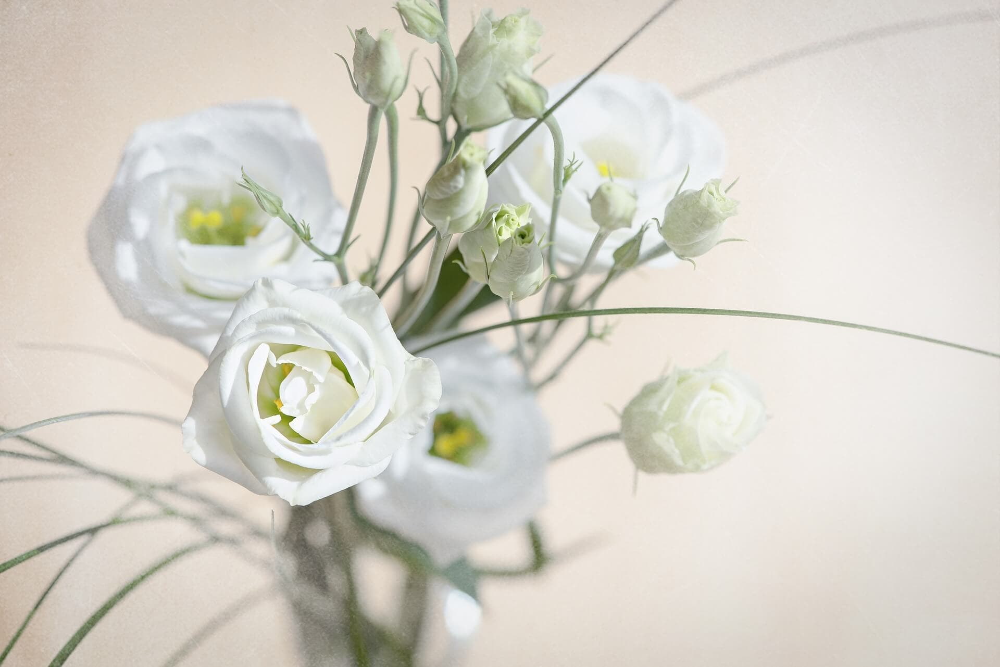

# New Project
Day 3 activity practice

## Lisianthus
Is a beautiful flower

### Description
Lisianthuses look are often to be confused with roses, but they are not roses. Don't let them fool you.

### To get more information on Lisianthus, follow these links:  
[Data](https://github.com/kate-peskova/Practice1/tree/main/data)  
[Code](https://github.com/kate-peskova/Practice1/tree/main/code)  
[References](https://github.com/kate-peskova/Practice1/tree/main/references)